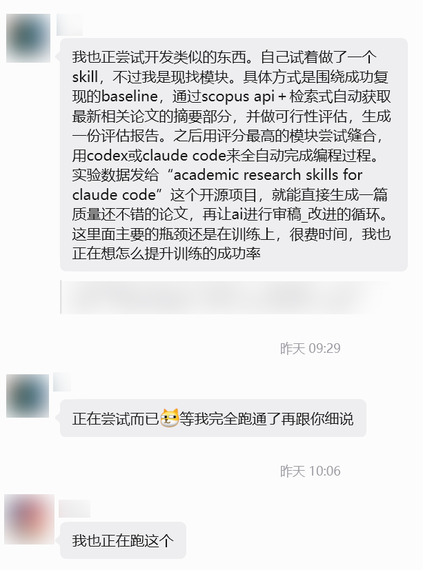

<p align="center">
  
</p>

<h1 align="center">🧵 I Just Wanna Graduate</h1>

<p align="center">
  <em>学术裁缝 Agent —— 让 AI 替你缝，你只管毕业</em>
</p>

<p align="center">
  🚧 计划于暑假开发，优先兼容"目标检测"项目，先占个坑
</p>

## 为什么学术裁缝可以被 AI 替代？

大部分实验改进的真实工作流：

```
学习基础 → 达到前置条件，搭好实验平台（基准模型 + 模块库 + 网络配置），可参考 YOLO Ultra
→ 理解基准模型 → 换个 Backbone → 不行
→ 加个注意力模块 → 不行
→ 看篇新 Paper，抄个模块过来（也就百来行代码）
→ 缝到网络不同位置，每个都试一遍
→ 跑实验看指标
→ 涨了？留下。没涨？换个模块继续
→ 指标够了 → 编个故事应付审稿人
```

整个过程没有真正的创新，只是排列组合和不断试错。核心模块代码通常就几十到一百多行，剩下全是复制粘贴改配置。

这不就是 AI Agent 最擅长的事吗？

## 这个 Agent 要做什么

本 Agent 只负责实验改进的自动化迭代部分。搭建可复现基准模型的实验平台和论文编故事需要你自行完成

```
设定目标指标
  → 分析当前网络结构
  → 生成改进思路
  → 检索 Paper / 创建新模块
  → 搭积木式组装到网络不同位置
  → 自动训练 + 评估
  → 涨了保留，没涨回退换路
  → 无限迭代，直到达标
```

## 计划特性

- 🔄 全自动闭环：分析 → 改进 → 实验 → 评估
- 🧱 模块库：几百个可插拔模块，像乐高一样搭网络
- 📄 Paper-Aware：自动检索论文，提取核心模块
- 🌳 多卡多方案搜索树：并行探索多条改进路径

## 暴力解法
假设手上有 4 张 4090，每一轮让 AI 基于当前最优结构生成 4 个不同的改进方案，一张卡跑一个，并行训练。跑完对比指标，涨了的留下作为下一轮起点，跑挂或变差的直接砍掉。4 个全挂？回退上一版，重新生成 4 个方案，继续迭代

你的 CC 反代 Claude Opus 4.6 tokens 超级消耗王

## 方案交流
欢迎对学术裁缝 Agent 感兴趣的同学一起交流，无论是技术方案、踩过的坑还是相关经验，都可以聊

📮 QQ: 1727235919

<p align="center">
  
</p>

## 爆杀结尾

<p align="center">
  <em>如果一个研究流程可以被 AI 完全自动化，那它本身就不该被称为"研究"</em>
</p>

## Related Work
[GitHub - Imbad0202/academic-research-skills: Academic Research Skills for Claude Code: research → write → review → revise → finalize](https://github.com/Imbad0202/academic-research-skills)

[GitHub - DavidZWZ/Awesome-Deep-Research: \[Up-to-date\] Awesome Agentic Deep Research Resources](https://github.com/DavidZWZ/Awesome-Deep-Research)

[GitHub - oboard/claude-code-rev: Runnable ClaudeCode source code](https://github.com/oboard/claude-code-rev)

[GitHub - ruc-datalab/DeepAnalyze: DeepAnalyze is the first agentic LLM for autonomous data science. 🎈你的AI数据分析师，自动分析大量数据，一键生成专业分析报告！](https://github.com/ruc-datalab/DeepAnalyze)

[GitHub - HKUDS/AI-Researcher: \[NeurIPS2025\] "AI-Researcher: Autonomous Scientific Innovation" -- A production-ready version: https://novix.science/chat](https://github.com/HKUDS/AI-Researcher)

[GitHub - lastmile-ai/mcp-agent: Build effective agents using Model Context Protocol and simple workflow patterns](https://github.com/lastmile-ai/mcp-agent)


[GitHub - OpenHands/OpenHands: 🙌 OpenHands: AI-Driven Development](https://github.com/OpenHands/OpenHands)

[GitHub - Aider-AI/aider: aider is AI pair programming in your terminal](https://github.com/Aider-AI/aider)


[GitHub - WecoAI/aideml: AIDE: AI-Driven Exploration in the Space of Code. The machine Learning engineering agent that automates AI R&D.](https://github.com/WecoAI/aideml)

[GitHub - SamuelSchmidgall/AgentLaboratory: Agent Laboratory is an end-to-end autonomous research workflow meant to assist you as the human researcher toward implementing your research ideas](https://github.com/SamuelSchmidgall/AgentLaboratory)

[GitHub - SakanaAI/AI-Scientist-v2: The AI Scientist-v2: Workshop-Level Automated Scientific Discovery via Agentic Tree Search](https://github.com/SakanaAI/AI-Scientist-v2)


[GitHub - Pthahnix/De-Anthropocentric-Research-Engine: De-Anthropocentric Research Engine — AI-powered academic research automation with deep literature survey, gap analysis, idea generation, experiment design & execution. Combines iterative deep research, adversarial debate, evolutionary...](https://github.com/Pthahnix/De-Anthropocentric-Research-Engine)